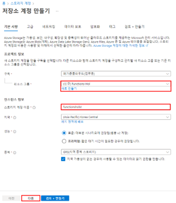
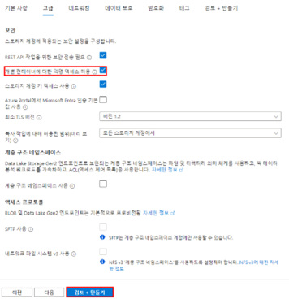
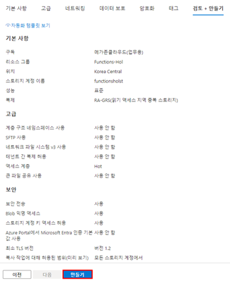
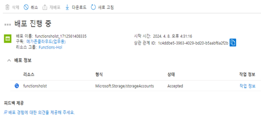
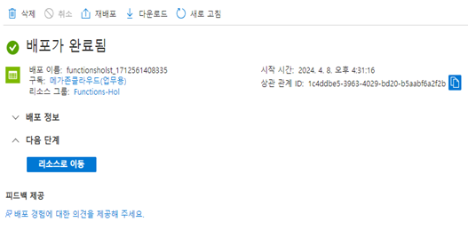
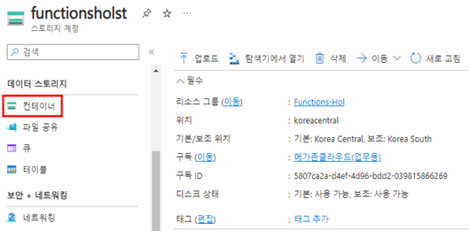
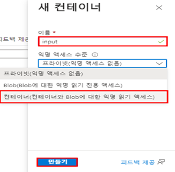

# TASK 4.스토리지 계정 리소스 생성
1.	스토리지 계정 생성을 위해 Azure Portal로 접속 후 스토리지 계정을 검색 후 클릭하여 생성을 진행합니다.
 

2.	만들기를 클릭합니다.
 

3.	“기본 사항” 탭에서 리소스 그룹에 새로 만들기를 클릭해서 리소스 그룹과 스토리지 계정 이름을 입력 후 “다음”을 클릭합니다.
 

4.	“고급” 탭에서 “개별 컨테이너에 대한 익명 액세스 허용”에 체크를 한 다음 “검토+만들기”를 클릭합니다.
 

5.	“검토 + 만들기” 탭에서 “만들기”를 클릭하여 스토리지 계정 생성을 마무리합니다.
 

6.	배포가 완료될 때까지 기다립니다.
 

7.	배포가 완료되었습니다. “리소스로 이동”을 클릭해서 개요로 이동합니다.
 

8.	컨테이너를 생성하기 위해 데이터 스토리지에 있는 “컨테이너”를 클릭합니다.
 

9.	컨테이너를 생성하기 위해 “+ 컨테이너” 버튼을 클릭합니다.
 

10.	새 컨테이너에서 이름을 입력 후 “익명 액세스 수준”을 “컨테이너(컨테이너와 Blob에 대한 익명 읽기 액세스)”로 선택한 다음 “만들기”를 클릭합니다.
- input, output 두개의 컨테이너 생성
 

11.	컨테이너 생성이 완료되었습니다. [완료]
 
