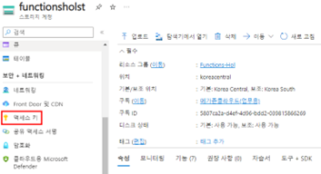
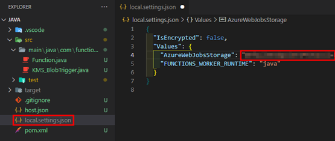
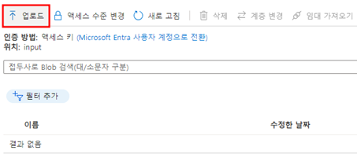
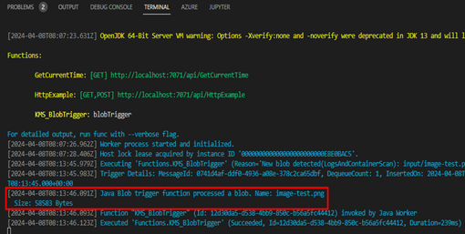

# TASK 5.BlobTrigger 로컬환경 실행
1.	Functions를 실행하기 전 스토리지 계정과 연동할 연결 문자열을 복사하기 위해 “`보안 + 네트워킹`”에 있는 “`액세스 키`”를 클릭합니다.
 


2.	“`연결 문자열`”에 표시버튼을 클릭해서 연결 문자열을 복사합니다.
 


3.	VSCode로 돌아와 local.settings.json파일을 열어 복사한 연결 문자열을 AzureWebJobsStorage에 붙여 넣은 후 저장합니다.
 


4.	기존 Functions이 로컬에서 동작 중이라면 ctrl+c를 눌러 기존 작업을 종료한 후 mvn 명령어를 사용하여 build작업 후 function을 동작 시킵니다.
Build : mvn clean package
Function 실행 : mvn azure-functions:run

- 중요 : 만약 mvn azure-functions:run명령어 실행 후 아래와 같은 에러가 발생하는 경우, host.json파일을 아래와 같이 수정이 필요합니다.
 


- host.json파일을 열어 아래와 같이 코드를 수정합니다.
```json
{
  "version": "2.0",
  "logging": {
    "applicationInsights": {
      "samplingSettings": {
        "isEnabled": true,
        "excludedTypes": "Request"
      }
    }
  },
  "extensionBundle": {
    "id": "Microsoft.Azure.Functions.ExtensionBundle",
    "version": "[3.3.0, 3.9.0)"
  }
}
```
- 다시 build 후 function 실행 명령어 수행

5.	Functions이 실행된 후 아래와 같은 url을 확인합니다.
 


6.	Azure Portal로 돌아가 생성한 output컨테이너를 클릭합니다.
 


7.	업로드를 클릭한 후 Blob 업로드에서 테스트용 이미지를 업로드 합니다.
 


8.	Blob 업로드에서 이미지 업로드 후 업로드 버튼을 클릭합니다. 
 


9.	이미지 업로드 후 실행중인 function 로그상에서 해당 이미지에 대한 정보가 아래와 같이 나오면 성공입니다. [완료]
 

- 추후 작업을 위해 ctrl+c를 눌러 작업을 종료시킵니다.

